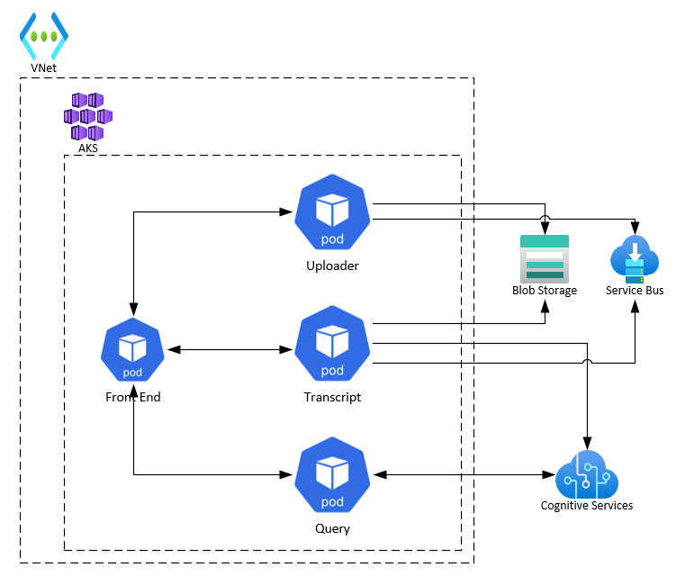

# Traduire
This my fork of .  I am using it to learn [Dapr]() patterns and practices. 

**Note**: It is known that the use of Dapr is overkill for this app (see [client example](./sample/cognitiveservices.test)). 

## App Overview 
The application uses Azure Cognitive Services to transcribe Podcasts in MP3 format to text.

## Data Flow

# Deployment
## Prerequisite
* A Linux machine or Windows Subsytem for Linux 
* PowerShell 7 for Linux
* Azure Cli and an Azure Subscription
* Terraform 0.12 or greater
* Helm 3 or greater
* Docker 
* [bjd.Common.Functions Modules](https://github.com/briandenicola/PSScripts/)

## Infrastructure 
* pwsh
* Import-Module bjd.Common.Functions
* cd ./Infrastructure
* $AppName = "trad{0}" -f (New-Uuid).Substring(0,4)
* ./create_infrastructure.ps1 -AppName $AppName -Subscription BJD_AZ_SUB01 -Region southcentralus

## Application Deployment 
* pwsh
* cd ./Deploy
* ./deploy_application.ps1 -AppName $AppName -Subscription BJD_AZ_SUB01

## UI Deployment 
* TBD

# Validate 
* TBD

# Architecture
## Concept 

