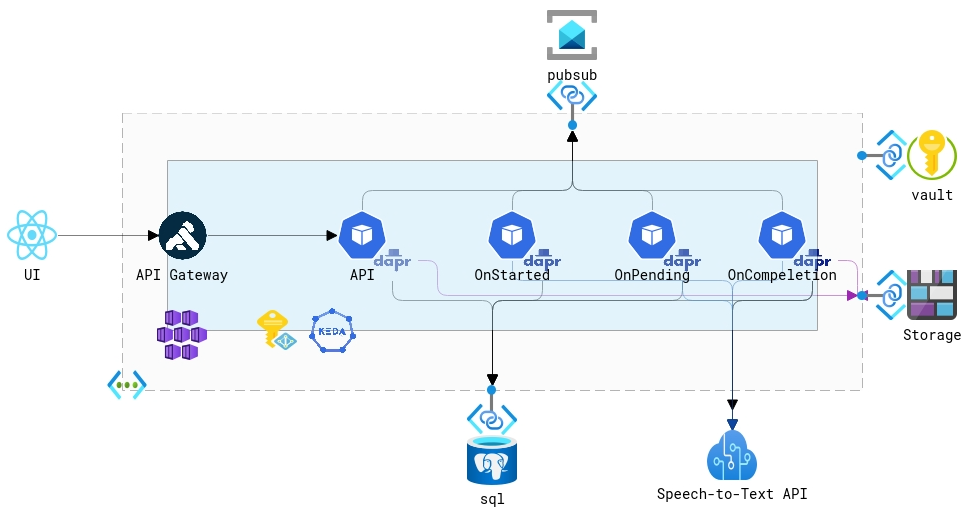
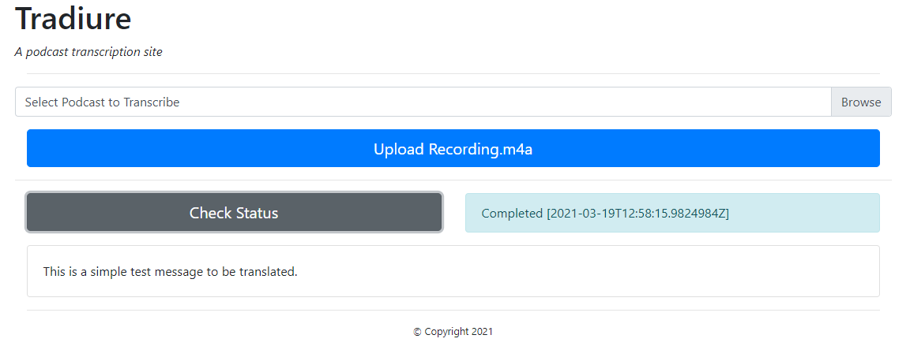

# Traduire 

## Overview 
This is an application to demonstrates various Azure services. It will transcribe an audio podcast (up to 50mb in size) to text using Azure Cognitive Services. It uses the Saga pattern and Virtual Actors to manage the transcription process.  It uses [Dapr](https://dapr.io) as the distributive runtime to manage communication between the various service components. The application exposes both a REST API consumed by a React-based UI and a gRPC API consumed by a commandline application

## Languages
* C# and dotnet 8
* PowerShell
* Hashicorp Terraform 

## Components
Component | Usage
------ | ------
Azure Kubernetes Service | Container Orchestration Runtime Platform  
Azure Blob Storage | Podcast Storage 
Azure Cognitive Services | Service that does actual transcription 
Azure Service Bus | Pubsub
Azure Web PubSub | Real-time UI upates
Azure Static Web Apps | Hosting platform for React UI
Azure PosgreSQL | Backing store
Azure Key Vault | Secret store 
Kong | API Gateway 
Keda | Autoscaler for saga components 

## Architecture

## Deployment

### Prerequisite 
__Or use DevContainer__
* A Linux machine or Windows Subsytem for Linux or Docker for Windows 
* PowerShell 7
* Azure Cli and an Azure Subscription
* Terraform 0.12 or greater
* Kubectl
* Helm 3 or greater
* Docker 

### Infrastructure 
* pwsh
* cd ./scripts
* ./create_infrastructure.ps1 -Subscription BJD_AZ_SUB01 -Region southcentralus 

### Application Deployment 
* pwsh
* cd ./scripts
* ./deploy_application.ps1 -AppName $AppName -Subscription BJD_AZ_SUB01 -DomainName bjdazure.tech [-SkipBuild] [-BuildOnly] [-upgrade] -verbose
* Update the DNS record of Uri to the IP Address returned by the script

### UI Deployment 
* pwsh
* cd ./scripts
* ./deploy_ui.ps1 -AppName $AppName -DomainName bjdazure.tech -Verbose

## Validate 

### Web Application
* Install [Playwright](https://playwright.dev)
* cd tests
* ./run-tests.sh traduire.bjd.tech #Or whatever your default Url from Azure Static Web Apps 

_Manually_
* Launch Browser
* Navigate to the URI outputed by the deploy_ui.ps1
    * Azure Static Website supports custom domain names, if desired. 
* Select and upload assets\recording.m4a
* Click 'Check Status' to watch the transcription go through its stages 
* Then the final result should be: \
    

### gRPC API 
* cd sample\grpc.client
* dotnet build 
* dontet run /ApiServer https://api.bjd.tech /ApiKey {{apikey}}
    * API Key is stored as a Secret in Kubernetes

## Backlog 
- [X] Add null_resource to bin Keda's identity to cluster
- [X] Test Cluster creation with new Terraform and Flux extension
- [X] Update Helm Chart - Service Accounts/Deployments 
- [X] Test applciation deployment
- [X] Validate application functionality
- [X] Update to Workload Identity
- [ ] Update React UI to Next.js
- [X] Update to dotnet8 
- [X] Deployment Updates
