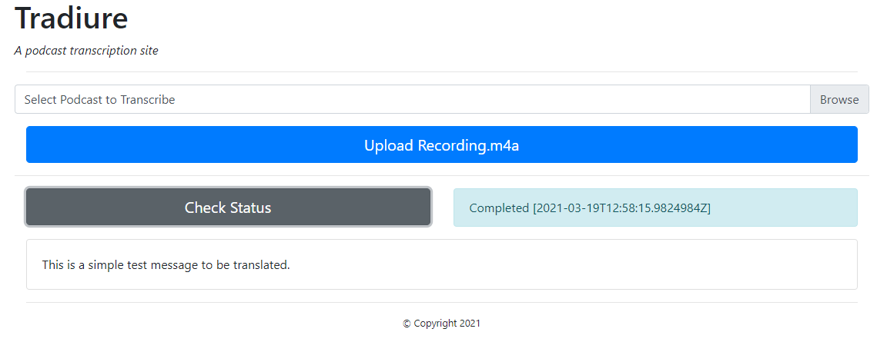

# Traduire 

## Overview 
This is an application to demotratres various Azure services. It will transcribe an audio podcast (up to 50mb in size) to text using Azure Cognitive Services. It uses a Saga pattern to monitor through out the  transcription.   It uses [Dapr](https://dapr.io) as the distributive runtime to manage communication between the various service components. The application exposes both a REST API consumed by a React-based UI and a gRPC API consumed by a commandline application

## Languages
* C# and dotnet 5 
* PowerShell
* Hashicorp Terraform 

## Components
Component | Usage
------ | ------
Azure Kubernetes Service | Container Orchestration Runtime Platform  
Azure Blob Storage | Podcast Storage 
Azure Cognitive Services | Service that does actual transcription 
Azure Service Bus | Pubsub
Azure Web PubSub | Real-time UI upates
Azure Static Web Apps | Hosting platform for React UI
Azure PosgreSQL | Backing store
Azure Key Vault | Secret store 
Kong | API Gateway 
Keda | Autoscaler for saga components 

## Architecture

## Deployment

### Prerequisite
* A Linux machine or Windows Subsytem for Linux or Docker for Windows 
* PowerShell 7
* Azure Cli and an Azure Subscription
* Terraform 0.12 or greater
* Kubectl
* Helm 3 or greater
* Docker 

### Infrastructure 
* pwsh
* cd ./Infrastructure
* $AppName = "trad{0}" -f (New-Guid).ToString('N').Substring(0,4)
* ./create_infrastructure.ps1 -AppName $AppName -Subscription BJD_AZ_SUB01 -Region southcentralus

### Application Deployment 
* pwsh
* cd ./Deploy
* ./deploy_application.ps1 -AppName $AppName -Subscription BJD_AZ_SUB01 -Uri api.bjd.tech [-upgrade] -verbose
* Update the DNS record of Uri to the IP Address returned by the script

### UI Deployment 
* pwsh
* cd ./Deploy
* ./deploy_ui.ps1 -AppName $AppName -ApiUri api.bjd.tech -Verbose

## Validate 

### Web Application
* Install [Playwright](https://playwright.dev)
* cd testing
* ./run-tests.sh traduire.bjd.tech #Or whatever your default Url from Azure Static Web Apps 

_Manually_
* Launch Browser
* Navigate to the URI outputed by the deploy_ui.ps1
    * Azure Static Website supports custom domain names, if desired. 
* Select and upload assets\recording.m4a
* Click 'Check Status' to watch the transcription go through its stages 
* Then the final result should be: \
    *

### gRPC API 
* cd sample\grpc.client
* dotnet build 
* dontet run /ApiServer api.bjd.tech /ApiServer {{apikey}}
    * API Key is stored as a Secret in Kubernetes

## Backlog 
- [X] API exposed via Kong
- [X] Tracing with Dapr / OpenTelemetry / App Insights
- [X] Migrate Cognitive Services to Dapr Secure Store
- [X] API to display transcribed text
- [X] Additional Node Pool for AKS
- [X] Let's Encrypt 
- [X] UX re-written in React 
- [X] Update API to use SAS tokens
- [ ] ~~Port AKS, KeyVault, PostgreSQL, and Service Bus to GCP equivalents~~
