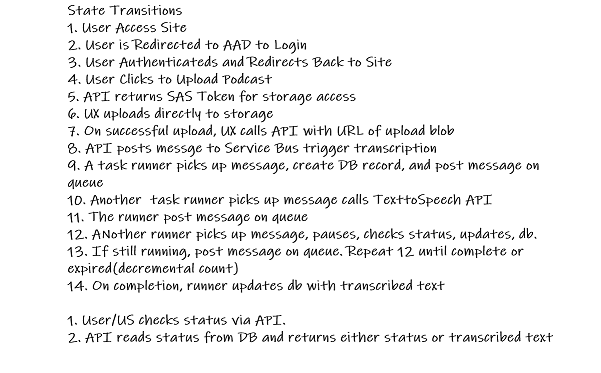

# Traduire
This my fork of [inhifistereo/traduire](https://github.com/inhifistereo/traduire).  I am using it to learn [Dapr](https://dapr.io) patterns and practices. 

**Note**: It is known that the use of Dapr is overkill for this app (see [client example](./sample/cognitiveservices.test)). 

## App Overview 
The application uses Azure Cognitive Services to transcribe Podcasts in MP3 format to text.

## Data Flow

## Deployment
### Prerequisite
* A Linux machine or Windows Subsytem for Linux 
* PowerShell 7 for Linux
* Azure Cli and an Azure Subscription
* Terraform 0.12 or greater
* Helm 3 or greater
* Docker 
* [bjd.Common.Functions Modules](https://github.com/briandenicola/PSScripts/packages/)

### Infrastructure 
* pwsh
* Import-Module bjd.Common.Functions
* cd ./Infrastructure
* $AppName = "trad{0}" -f (New-Uuid).Substring(0,4)
* ./create_infrastructure.ps1 -AppName $AppName -Subscription BJD_AZ_SUB01 -Region southcentralus

### Application Deployment 
* pwsh
* cd ./Deploy
* ./deploy_application.ps1 -AppName $AppName -Subscription BJD_AZ_SUB01 -verbose

### UI Deployment 
* TBD

## Validate 
_Temporary steps_
### Run UI
* Get Kong Service IP - kubectl get service kong-kong-proxy -o jsonpath={.status.loadBalancer.ingress[].ip}
* Get API Key  - kubectl get secret ${AppName}-apikey -o json | jq ".data.key" | tr -d "\"" | base64 -d
* cd source\ui\
* Update pages\Index.cshtml. Replace {{replaceme}} with Kong IP and API Key
* dotnet run --urls=http://localhost:5002/

### Browser 
* Launch UI
* Select assets\recording.m4a

## Backlog 
- [X] API exposed via Kong
- [X] Tracing with Dapr / OpenTelemetry / App Insights
- [ ] Migrate Cognitive Services to Dapr HTTP Component
- [ ] UX re-written in React 
- [ ] Azure AD Authentication
- [ ] Github Deployment via Actions  
